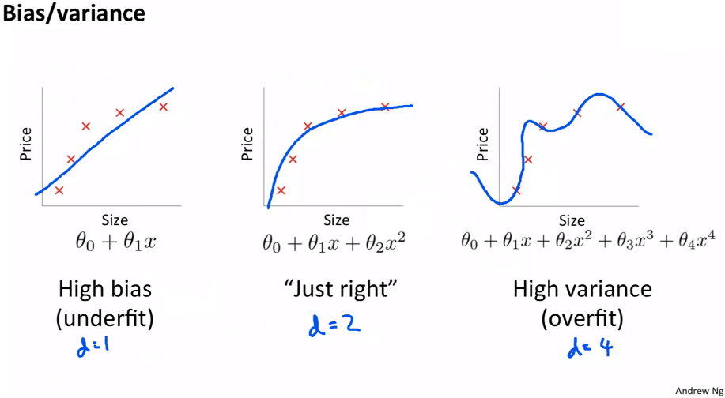

# My progress in fastai course - Lesson 5

#### Useful links:

1. [Video](https://course.fast.ai/videos/?lesson=5)
2. [Documentation collab](https://docs.fast.ai/collab.html)
4. [Lesson discussion thread](https://forums.fast.ai/t/lesson-5-in-class-discussion/30864)
5. [hiromis (GitHub)](https://github.com/hiromis/notes/blob/master/Lesson5.md)
6. [notes by PoonamV](https://forums.fast.ai/t/deep-learning-lesson-5-notes/31298)

#### Data set, which I used:

   * [Collab_filter.xlsx](https://github.com/fastai/course-v3/blob/master/files/xl/collab_filter.xlsx);
   * [MNIST](deeplearning.net/data/mnist/mnist.pkl.gz);
   * [graddesc.xlsm](https://github.com/fastai/course-v3/blob/master/files/xl/graddesc.xlsm);
   * [Google sheets version](https://docs.google.com/spreadsheets/d/1uUwjwDgTvsxW7L1uPzpulGlUTaLOm8b-R_v0HIUmAvY/edit#gid=740812608)
   * [entropy_example.xlsx](https://github.com/fastai/course-v3/blob/master/files/xl/entropy_example.xlsx)

   Problem:  neural net from scratch.

#### My notes:

   - **Freezing** - don't back propagate the gradients back into those layers, so don't update those parameters;
   - **Discriminative learning rates** - in unfreezing; Using it with learning rate, because for the early layers is smaller, it's going to move them around less because we think they're already pretty good and also if it's already pretty good to the optimal value, if you used a higher learning rate, it could kick it out - it could actually make it worse which we really don't want to happen.
   - [**one hot encodings**](https://machinelearningmastery.com/why-one-hot-encode-data-in-machine-learning/) -  is where the integer encoded variable is removed and a new binary variable is added for each unique integer value;
   - [**affine functions**](https://en.wikipedia.org/wiki/Affine_transformation) - a function between affine spaces which preserves points, straight lines and planes
   - [**bias vs variance**](https://en.wikipedia.org/wiki/Bias%E2%80%93variance_tradeoff):
       * the bias is an error from erroneous assumptions in the learning algorithm. High bias can cause an algorithm to miss the relevant relations between features and target outputs (underfitting),
       * the variance is an error from sensitivity to small fluctuations in the training set. High variance can cause an algorithm to model the random noise in the training data, rather than the intended outputs (overfitting);
       
       
       
#### Tips:

   1. **fit_one_cycle** - three kind of putting numbers in this function:
       * single number: e.g. 1e-3 -> every layer gets the same learning rate,
       * slice with single number e.g. slice(1e-3) -> the final layers get a learning rate of whatever you wrote down (1e-3), and then all the other layers get the same learning rate which is that divided by 3,
       * slice with two number: e.g. slice(1e-5, 1e-3) -> the first layer will get 1e-5, but final layer will get 1e-3 and the other layers will get learning rate that are equally spread between those two; 
   2. **The cold start problem** (in recommender system) - the situation when we add a new user and do not have enough data about him;
   3. [**PCA**](https://en.wikipedia.org/wiki/Principal_component_analysis) - Principal Components Analysis;
   4. [**SGD**](https://en.wikipedia.org/wiki/Stochastic_gradient_descent) - Stochastic Gradient Descent. This algorithm give a random sample of the data beside gradient descent;
   5. [**Momentum**](https://www.quora.com/What-exactly-is-momentum-in-machine-learning) - metods in the context of machine learning;
    "You were here and your learning rate was too small, and you just keep doing the same steps. Or if you keep doing the same steps, then if you also add in the step you took last time, and your steps are going to get bigger and bigger until eventually they go too far. But now, of course, your gradient is pointing the other direction to where your momentum is pointing. So you might just take a little step over here, and then you'll start going small steps, bigger steps, bigger steps, small steps, bigger steps, like that. That's kind of what momentum does."
    
    
    
   6. **Exponentially weighted moving average** - \begin{align} S_{t}=\alpha\cdot g+(1-\alpha )S_{t-1} \end{align}
   7. **RMSProp** - created by Geoffrey Hinton. Similar to momentum but in this way exponentially weighted moving average updates gradient squared; "If my gradient is really small and consistently really small, this will be a small number. If my gradient is highly volatile, it's going to be a big number. Or if it's just really big all the time, it'll be a big number".
   8. **Adam** - keeping track of the exponentially weighted moving average of the gradient squared (RMSProp) and also keep track of the exponentially weighted moving average of my steps (momentum);
   9. **Cross-entrpy loss** - loss function, "it's the sum of all of your one hot encoded variables times all of your activations";
   10. In Fastai: "if you ask for cross entropy loss (nn.CrossEntropyLoss), it actually does the softmax inside the loss function. So it's not really just cross entropy loss, it's actually softmax then cross entropy loss.";

#### Other resources:

   * [An overview of gradient descent optimization algorithms](http://ruder.io/optimizing-gradient-descent/)
   * [Netflix and Chill: Building a Recommendation System in Excel](https://towardsdatascience.com/netflix-and-chill-building-a-recommendation-system-in-excel-c69b33c914f4)
   * [Finally, a Machine That Can Finish Your Sentence](https://www.nytimes.com/2018/11/18/technology/artificial-intelligence-language.html)
   * [Jeremy Howard interviews Leslie Smith](https://www.youtube.com/watch?v=dxpyg3mP_rU&feature=youtu.be)
   * [How does Netflix recommend movies? Matrix Factorization](https://www.youtube.com/watch?v=ZspR5PZemcsv)