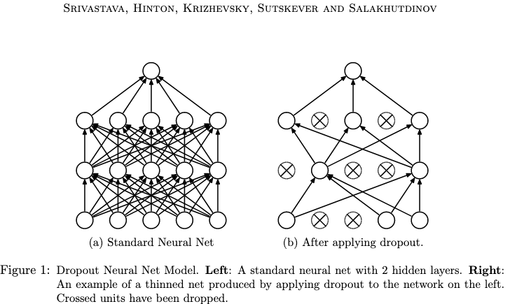

# My progress in fastai course - Lesson 6

#### Useful links:

1. [Video](https://course.fast.ai/videos/?lesson=6)
2. [Documentation](https://docs.fast.ai)
3. [Lesson discussion thread](https://forums.fast.ai/t/lesson-6-in-class-discussion/31440)
4. [hiromis (GitHub)](https://github.com/hiromis/notes/blob/master/Lesson6.md)
5. [Lesson 6 Advanced Discussion](https://forums.fast.ai/t/lesson-6-advanced-discussion/31442)

#### Data set, which I used:

   * [Rossman dataset (Kaggle competition)](files.fast.ai/part2/lesson14/rossmann.tgz);

   Problem:  regularization and convolutions.

#### My notes:

   - **data augumentation** - modify model inputs during training in order to effectively increase data size
   - **regularization**:
       * dropout - remove activations at random during training in order to regularize the model
       
           
           
       * batch normalization - adjust the parameterization of a model in order to make the loss surface smoother
       
           
           
   - **RMPSE** - Root Mean Square Percentage Error;
   - [**Time series**](https://en.wikipedia.org/wiki/Time_series) - a series of data point indexed in time order;
   - [**add_datepart**](https://docs.fast.ai/tabular.transform.html#add_datepart) - Helper function that adds columns relevant to a date in the column field_name of df;
   
   
       
#### Tips:

   1. When we know about same nonlinear behavior, we could add this information as feature engineering (for example payday in time series);
   2. Batch normalization doesn't reducing internal covariate shift, but make smooth decrease in the loss function;
   3. Transform - run every time something is grabbed from a dataset;
   4. Preprocesses - run once on the training set and then any kind of state or metadata that's created is then shared with the validation and test set;
   5. -1 is missing value in Pandas;

#### Other resources:

   * [CS1114 Section 6: Convolution](http://www.cs.cornell.edu/courses/cs1114/2013sp/sections/S06_convolution.pdf);
   * [Convolution arithmetic](https://github.com/vdumoulin/conv_arithmetic/blob/master/README.md);
   * [Normalization in Deep Learning](https://arthurdouillard.com/post/normalization/);
   * [Understanding Categorical Cross-Entropy Loss, Binary Cross-Entropy Loss, Softmax Loss, Logistic Loss, Focal Loss and all those confusing names](https://gombru.github.io/2018/05/23/cross_entropy_loss/);
   * [How do Convolutional Neural Networks work?](https://brohrer.github.io/how_convolutional_neural_networks_work.html);
   * [Image Processing and Computer Vision](https://openframeworks.cc/ofBook/chapters/image_processing_computer_vision.html);
   * [BERT Explained: State of the art language model for NLP](https://towardsdatascience.com/bert-explained-state-of-the-art-language-model-for-nlp-f8b21a9b6270);
   * [CCNBook/Perception](https://grey.colorado.edu/CompCogNeuro/index.php/CCNBook/Perception);
   * [Image Kernels](http://setosa.io/ev/image-kernels/);
   * [Kernel (imaage processing) - wikipedia](https://en.wikipedia.org/wiki/Kernel_(image_processing));
   * [How Does Batch Normalization Help Optimization?](https://arxiv.org/pdf/1805.11604.pdf?fbclid=IwAR3UbSdoiD_Tv1BX43IK7daWmeG44jBH6PGGIqgpS0KQa7HAkhHoz0wbUMI);
   * [Why is L2 regularization incorrectly called weight decay in the Deep Learning community?](https://www.quora.com/Why-is-L2-regularization-incorrectly-called-weight-decay-in-the-Deep-Learning-community?fbclid=IwAR13fl0mpk7f_pqorHX-sQ7Yu7ro0-a9yqa75OPTiCE0oHAvPgMaTSCpBzk);
   * [Dropout:  A Simple Way to Prevent Neural Networks fromOverfitting](http://jmlr.org/papers/volume15/srivastava14a.old/srivastava14a.pdf); 
   * [Batch Normalization: Accelerating Deep Network Training byReducing Internal Covariate Shift](https://arxiv.org/pdf/1502.03167.pdf);
   * [CNNs from different viewpoints](https://medium.com/impactai/cnns-from-different-viewpoints-fab7f52d159c)
   