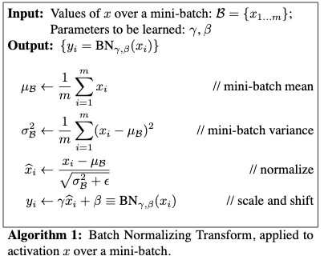

# My progress in fastai course - Lesson 6

#### Useful links:

1. [Video](https://course.fast.ai/videos/?lesson=6)
2. [Documentation](https://docs.fast.ai)
3. [Lesson discussion thread](https://forums.fast.ai/t/lesson-6-in-class-discussion/31440)
4. [hiromis (GitHub)](https://github.com/hiromis/notes/blob/master/Lesson6.md)
5. [Lesson 6 Advanced Discussion](https://forums.fast.ai/t/lesson-6-advanced-discussion/31442)

#### Data set, which I used:

   * [Rossman dataset (Kaggle competition)](files.fast.ai/part2/lesson14/rossmann.tgz);

   Problem:  regularization and convolutions.

#### My notes:

   - **data augumentation** - modify model inputs during training in order to effectively increase data size
   - **regularization**:
       * dropout - remove activations at random during training in order to regularize the model
       
           
           
           "I went to my bank. The tellers kept changing and I asked one of them why. He said he didn't know but they got moved around a lot. I figured it must be because it would require cooperation between employees to successfully defraud the bank. This made me realize that randomly removing a different subset of neurons on each example would prevent conspiracies and thus reduce overfitting"
           [Hinton: Reddit AMA](https://www.reddit.com/r/MachineLearning/comments/4w6tsv/ama_we_are_the_google_brain_team_wed_love_to/d6dgyse/)
           
       * batch normalization - adjust the parameterization of a model in order to make the loss surface smoother
       
           
           
            This is type of layer for the neural network that make loss surface smoother normalizing parameters inside hidden layers. Reduce problem when input changes, so the loss function is more stable and less bumpy. Could use higher learning rates - batch normalization makes sure that there’s no activation that’s gone really high or really low. It reduces overfitting - it has a slight regularization effects.
           
   - **RMPSE** - Root Mean Square Percentage Error;
   - [**Time series**](https://en.wikipedia.org/wiki/Time_series) - a series of data point indexed in time order;
   - [**add_datepart**](https://docs.fast.ai/tabular.transform.html#add_datepart) - Helper function that adds columns relevant to a date in the column field_name of df;
   - **categorify** -  it's going to take these strings, it's going to find all of the possible unique values of it, and it's going to create a list of them, and then it's going to turn the strings into numbers;
   - [**FloatList**](https://docs.fast.ai/data_block.html#FloatList) - ItemList suitable for storing the floats in items for regression. Will add a log if this flag is True; When label_cls = FloatList, fastai know that you have regresion;  
   - **Heat map** - a picture which shows what part of the image did the CNN focus on when it was trying to decide what this picture is;
   - **Hook** - lets you (as the name suggests) hook into the PyTorch machinery itself, and run any arbitrary Python code you want to;
   
       
#### Tips:

   1. When we know about same nonlinear behavior, we could add this information as feature engineering (for example payday in time series);
   2. Batch normalization doesn't reducing internal covariate shift, but make smooth decrease in the loss function;
   3. Transform - run every time something is grabbed from a dataset;
   4. Preprocesses - run once on the training set and then any kind of state or metadata that's created is then shared with the validation and test set;
   5. -1 is missing value in Pandas;
   6. Preprocesses in fastai - call any kind of item list creator, for example: `procs=[FillMissing, Categorify, Normalize]`. Could use this in TabularList;
   7. Day of week and month and day of month treat as categorial variable, because day of month, isn't going to have a nice smooth curve. Watch out for cardinality (levels in category)!
   8. When we have much parameters we have tendency to overfitting;
   9. Interestingly, you can dig into the PyTorch source code and you can find the actual C code where dropout is implemented
   
       
       
   10. In learnier (this case tabular_learner) we should set dropout parameters (ps and emb_drop);
   11. Use big size kernels at the first in CNN;
   12. CNN use element-wise multiply.
   13. Averange pooling
   
       
      
   14. [CNN key word](https://en.wikipedia.org/wiki/Convolutional_neural_network):
       - padding,
       - [kernel](https://en.wikipedia.org/wiki/Kernel_(image_processing)),
       - averange pool,
       - fully connected,
       - weights,
       - stride;
   15. .cuda - pop something onto GPU;
   16. .store - where it stores away the thing you asked it to hook;
   
#### Interesting part of video

   - [Manual convolutions](https://www.youtube.com/watch?v=U7c-nYXrKD4&feature=youtu.be&t=5364);
   - [Creating heat map](https://www.youtube.com/watch?v=U7c-nYXrKD4&feature=youtu.be&t=5630);
   - [Hook](https://www.youtube.com/watch?v=hkBa9pU-H48&t=5646s);

#### Other resources:

   * [CS1114 Section 6: Convolution](http://www.cs.cornell.edu/courses/cs1114/2013sp/sections/S06_convolution.pdf);
   * [Convolution arithmetic](https://github.com/vdumoulin/conv_arithmetic/blob/master/README.md);
   * [Normalization in Deep Learning](https://arthurdouillard.com/post/normalization/);
   * [Understanding Categorical Cross-Entropy Loss, Binary Cross-Entropy Loss, Softmax Loss, Logistic Loss, Focal Loss and all those confusing names](https://gombru.github.io/2018/05/23/cross_entropy_loss/);
   * [How do Convolutional Neural Networks work?](https://brohrer.github.io/how_convolutional_neural_networks_work.html);
   * [Image Processing and Computer Vision](https://openframeworks.cc/ofBook/chapters/image_processing_computer_vision.html);
   * [BERT Explained: State of the art language model for NLP](https://towardsdatascience.com/bert-explained-state-of-the-art-language-model-for-nlp-f8b21a9b6270);
   * [CCNBook/Perception](https://grey.colorado.edu/CompCogNeuro/index.php/CCNBook/Perception);
   * [Image Kernels](http://setosa.io/ev/image-kernels/);
   * [How Does Batch Normalization Help Optimization?](https://arxiv.org/pdf/1805.11604.pdf?fbclid=IwAR3UbSdoiD_Tv1BX43IK7daWmeG44jBH6PGGIqgpS0KQa7HAkhHoz0wbUMI);
   * [Why is L2 regularization incorrectly called weight decay in the Deep Learning community?](https://www.quora.com/Why-is-L2-regularization-incorrectly-called-weight-decay-in-the-Deep-Learning-community?fbclid=IwAR13fl0mpk7f_pqorHX-sQ7Yu7ro0-a9yqa75OPTiCE0oHAvPgMaTSCpBzk);
   * [Dropout:  A Simple Way to Prevent Neural Networks fromOverfitting](http://jmlr.org/papers/volume15/srivastava14a.old/srivastava14a.pdf); 
   * [Batch Normalization: Accelerating Deep Network Training byReducing Internal Covariate Shift](https://arxiv.org/pdf/1502.03167.pdf);
   * [CNNs from different viewpoints](https://medium.com/impactai/cnns-from-different-viewpoints-fab7f52d159c)