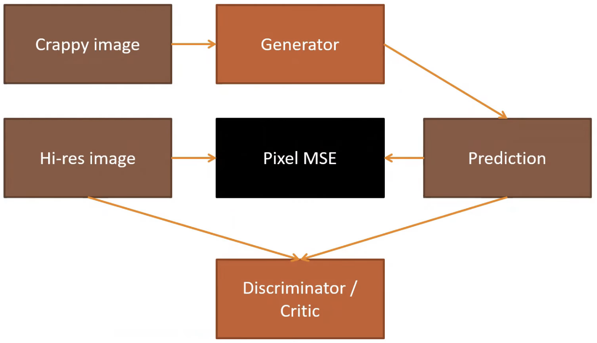
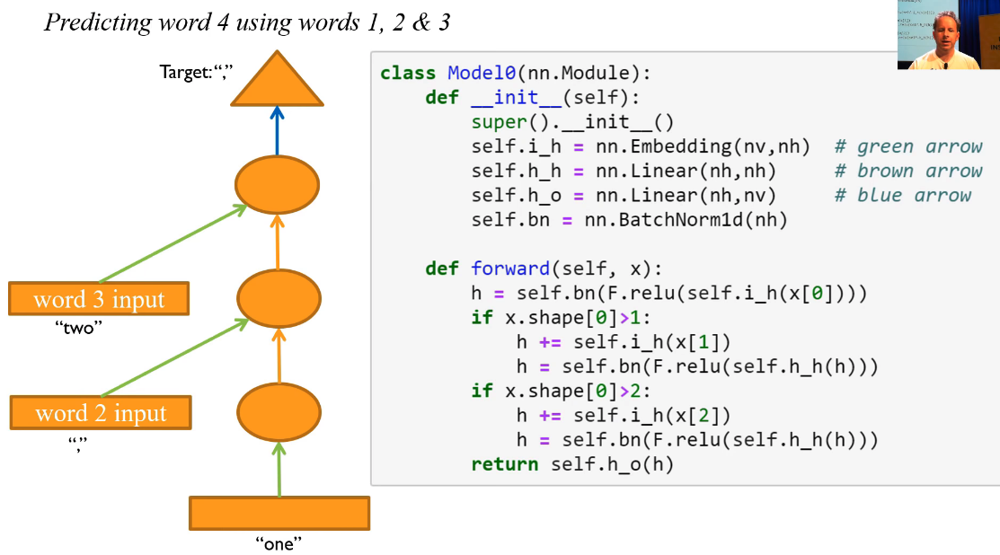
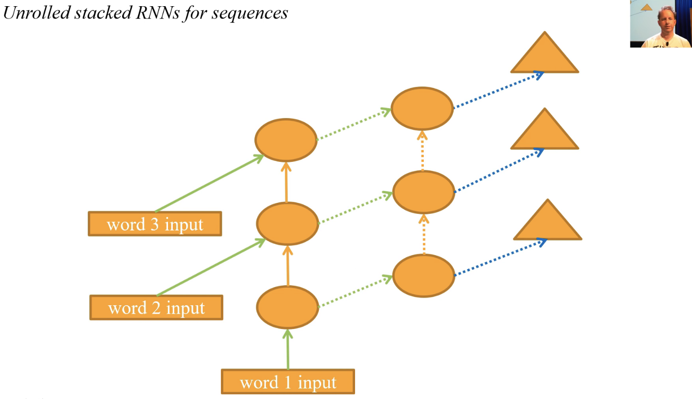

# My progress in fastai course - Lesson 7

#### Useful links:

1. [Video](https://course.fast.ai/videos/?lesson=7)
2. [Documentation](https://docs.fast.ai)
3. [Lesson discussion thread](https://forums.fast.ai/t/lesson-7-in-class-chat/32554/118)
4. [hiromis (GitHub)](https://github.com/hiromis/notes/blob/master/Lesson7.md)
5. [Lesson 7 Advanced Discussion](https://forums.fast.ai/t/lesson-7-further-discussion/32555)

#### Data set, which I used:

   * [MNIST](http://yann.lecun.com/exdb/mnist/);
   * [CamVid](http://mi.eng.cam.ac.uk/research/projects/VideoRec/CamVid/)
   * [LSUN bedroom scene](https://www.kaggle.com/jhoward/lsun_bedroom/data)

   Problem:  Resnets from scratch, U-net, GAN.

#### My notes:

   - **GAN** - Generative adversarial networks;
   
       
   
   - **Residual learning: a building block (by Kaiming He)** - 
       
        
           
           -> Output = Conv2(Conv1(x)) instead Output = x + Conv2(Conc1(x));

   - **skip / identity connection** - 56 layers worth of convolutions in that has to be at least good as the 20 layer version because it could always just set conv2 and conv1 to a bunch of 0 weights for everything except for the first 20 layers because the X (i.e. the input) could just go straight through;

        

        

   - **.no_split** - method to create an empty validation set;
   - **MergeLayer** -> x+x.orig; 
   - **dense=True in MergeLayer** - if it is TRUE goes x+x.orig; if it is FALSE goes cat([x,x.orig]);
   - **U-Net** - Convolutional Networks for Biomedical Image Segmentation;
   - **parallel** is a function, which run another function in parallel;
   - [**GANLearner**](https://docs.fast.ai/vision.gan.html#GANLearner) - learner for GAN. GANLearner have interesting parameter: weights_gen=(1.,50.) is that, what we actually do is we don't only use the critic as the loss function;
   - [**RNN**](https://en.wikipedia.org/wiki/Recurrent_neural_network) - Recurrent Neural Nerwork:
   
       
   
       
       - triangle is output;
       - circle is activations (hidden state - we also call that);
       - rectangle is input);
       
       Example for try to predict the third word using the first two words:
       
       
        1. Grab word 1 as an input.
        2. Chuck it through an embedding, create some activations.
        3. Pass that through a matrix product and nonlinearity.
        4. Grab the second word.
        5. Put it through an embedding.
        6. Then we could either add those two things together or concatenate them. Generally speaking, when you see two sets of activations coming together in a diagram, you normally have a choice of concatenate or or add. And that's going to create the second bunch of activations.
        7. Then you can put it through one more fully connected layer and softmax to create an output.

       
#### Tips:

   1. In MNIST, we aren't going to use get_transform, because this is digit recognition and digit recognition, you wouldn't want to flip it left right.
   2. For small images of digits like this, you just add a bit of random padding. So I'll use the random padding function which actually returns two transforms; the bit that does the padding and the bit that does the random crop. So you have to use star(`*`) to say put both these transforms in this list.
   3. Use .normalize when you aren't using pre-trained model.
   4. When dense is TRUE it's not called a ResNet, it's called a DenseNet.
   5. DenseNets are very memory intensive. Good for small datasets.
   6. GANs hate momentum when you're training them. It kind of doesn't make sense to train them with momentum because you keep switching between generator and critic, so it's kind of tough.
   7. One of the tough things about GANs is that these loss numbers, they're meaningless.
   8. The only way to know how are they doing is to actually take a look at the results from time to time. If you put show_img=True in GANLearner.from_learners().
   9. In these kind of architectures where you have a downsampling path followed by an upsampling path, the downsampling path is very often called the encoder as you saw in our code. And the upsampling path is very often called the decoder.
   10. When you start creating long timescales and multiple layers, these things get impossible to train.
   
#### Interesting part of video

   - [Basic CNN with batchnorm](https://www.youtube.com/watch?v=9spwoDYwW_I&t=661);
   - [Deep Residual Learning for Image Recognition](https://www.youtube.com/watch?v=9spwoDYwW_I&t=984)
   - [Visualizing the Loss Landscape of Neural Nets](https://www.youtube.com/watch?v=9spwoDYwW_I&t=1236)
   - [U-Net: Convolutional Networks for Biomedical Image Segmentation](https://www.youtube.com/watch?v=9spwoDYwW_I&t=1816)
   - [**Question** about concatenating every layer together in a DenseNet work when the size of the image/feature maps is changing through the layers](https://www.youtube.com/watch?v=9spwoDYwW_I&t=2990)
   - [Wasserstein GAN](https://www.youtube.com/watch?v=9spwoDYwW_I&t=4600)
   - [Perceptual Losses for Real-Time Style Transfer and Super-Resolution](https://www.youtube.com/watch?v=9spwoDYwW_I&t=4717)
   - [RNN](https://www.youtube.com/watch?v=9spwoDYwW_I&t=5919)

#### Other resources:

   * [Visualizing the Loss Landscape of Neural Nets](https://arxiv.org/abs/1712.09913);
   * [Perceptual Losses for Real-Time Style Transfer and Super-Resolution](https://arxiv.org/abs/1603.08155);
   * [The Future of Software Intelligence: a Fireside Chat](https://www.youtube.com/watch?v=v16uzPYho4g);
   * [ipyexperiments](https://github.com/stas00/ipyexperiments/);
   * [Deep Residual Learning for Image Recognition](https://arxiv.org/abs/1512.03385);
   * [A guide to convolution arithmetic for deep learning](https://arxiv.org/pdf/1603.07285.pdf);
   * [WGAN paper](https://arxiv.org/abs/1701.07875);